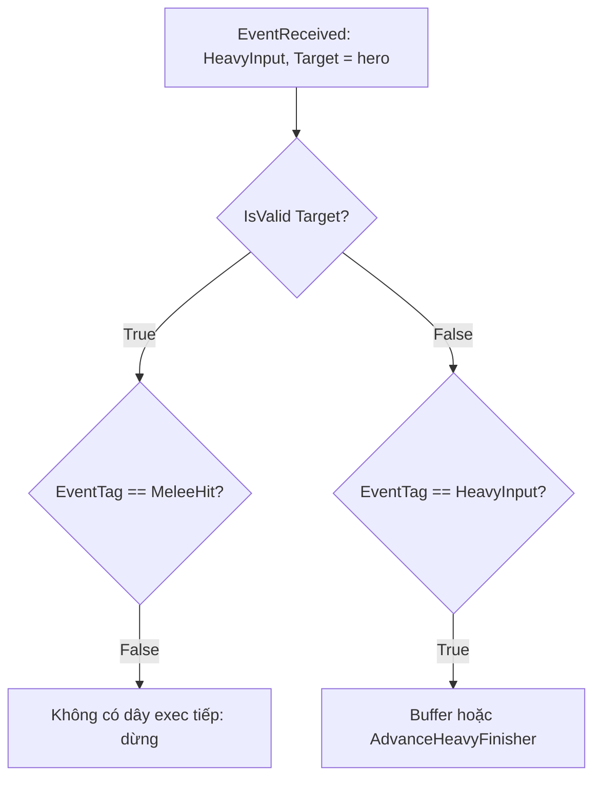

# Chẩn đoán regen và combo LMB → LMB → RMB

Ngày kiểm tra: 19/09/2026. Kết luận dựa trên C++, live Blueprint properties/pin connections và log PIE hiện có. **Chưa sửa source/asset, chưa compile hoặc chạy PIE mới.**

## 1. Regen: backing attribute reference bị mất

Ba asset trong `/Game/GASDocumentation/Characters/Shared/GameplayEffects/` có cấu hình:

| Asset | Attribute được cộng | Backing Attribute Name | Attribute reference | AttributeOwner |
| --- | --- | --- | --- | --- |
| `GE_HealthRegen` | Health, reference hợp lệ | HealthRegenRate | rỗng | None |
| `GE_ManaRegen` | Mana, reference hợp lệ | ManaRegenRate | rỗng | None |
| `GE_StaminaRegen` | Stamina, reference hợp lệ | StaminaRegenRate | rỗng | None |

Vị trí lỗi là **attribute đầu vào để tính magnitude**, không phải attribute được cộng ở hàng Modifier bên ngoài. Tên lưu trong struct còn đó nhưng không trỏ tới property trong `GDAttributeSetBase`.

Evidence bổ sung:

- `BP_HeroCharacter.StartupEffects` đã chứa đủ ba GE.
- `GDHeroCharacter.cpp:111` gọi `AddStartupEffects()`; `GDCharacterBase.cpp:325` tạo spec/apply trên authority.
- Cả ba GE là Infinite, Period = 1, coefficient = 1, pre/post additive = 0, Source capture, Snapshot = false.
- `GE_HeroAttributes` đã gán rates Health=1, Mana=1, Stamina=2 với reference hợp lệ.
- `Saved/Logs/HacknSlash_Demo.log:12633`, `:12634`, `:12636` ghi lỗi tương ứng Mana/Health/Stamina vào 08:12:16 UTC:

```text
Modifier on spec: Default__GE_ManaRegen_C was asked to CalculateMagnitude and failed, falling back to 0.
Modifier on spec: Default__GE_HealthRegen_C was asked to CalculateMagnitude and failed, falling back to 0.
Modifier on spec: Default__GE_StaminaRegen_C was asked to CalculateMagnitude and failed, falling back to 0.
```

Vì vậy, effect có thể được apply và tick đều nhưng mỗi tick cộng **0**. Tăng rate hoặc thêm Tick trong character không xử lý reference đang mất. Reference hỏng phù hợp với tình huống migrate/rename class, nhưng audit chưa xác nhận lịch sử nào đã gây ra nó.

Theo [Epic: Gameplay Effects](https://dev.epicgames.com/documentation/unreal-engine/gameplay-effects-for-the-gameplay-ability-system-in-unreal-engine), periodic GE thực thi ở mỗi Period; Target Tag Requirements quyết định effect có được tiếp tục thực thi hay không.

### Cách chỉnh cụ thể khi triển khai

Mở từng GE → Class Defaults → `Modifiers[0]` → `Modifier Magnitude` → `Attribute Based Magnitude` → `Backing Attribute` → `Attribute to Capture`.

Chọn lại bằng dropdown, không chỉ giữ text tên cũ:

- Health GE → `GDAttributeSetBase.HealthRegenRate`.
- Mana GE → `GDAttributeSetBase.ManaRegenRate`.
- Stamina GE → `GDAttributeSetBase.StaminaRegenRate`.

Nếu UI vẫn giữ selection cũ, chọn None rồi chọn đúng attribute. Sau compile/save, xác minh property thực tế có dạng `/Script/HacknSlash_Demo.GDAttributeSetBase:HealthRegenRate` và AttributeOwner là `GDAttributeSetBase` (tương tự Mana/Stamina).

Giữ Infinite, Period 1 giây, coefficient 1, Source, Snapshot false trong bước sửa đầu tiên. Health đang dùng `AddFinal`, Mana/Stamina dùng `AddBase`; sự khác biệt này không giải thích việc cả ba cùng thất bại capture, không gộp đổi operation vào bước chứng minh nguyên nhân.

### Kiểm tra sau chỉnh

- PIE mới; giảm từng resource xuống dưới 100 rồi quan sát 5 periodic ticks. Khi không có drain/damage/inhibition, kỳ vọng tăng tương ứng 5 Health, 5 Mana, 10 Stamina, cap ở Max.
- Kiểm tra actual attribute và HUD cùng tăng; không chỉ text `+1/+2`.
- Log không còn CalculateMagnitude failure cho ba effect.
- StaminaRegen đang ignore `State.Sprinting` và `State.Dead`: không dùng lúc đang sprint để kết luận regen vẫn hỏng.
- HealthRegen có Target Tag Requirements rỗng, khác Mana/Stamina: bổ sung chặn `State.Dead` nếu thiết kế không cho hồi khi chết; test death/respawn riêng.

## 2. Combo: HeavyInput bị route vào nhánh hit

Input mapping đúng đường:

`RMB → Ability2 → GA_MeleeHeavyAttack → SendGameplayEventToActor(hero, Event.Combat.HeavyInput)`.

`GA_MeleeHeavyAttack` tạo payload có cả Instigator và Target = hero, sau đó EndAbility. Log có `[GA_MeleeHeavyAttack_C_0] RMB`, ví dụ dòng 12639. `GA_MeleeAttack` cũng đã subscribe `Event.Combat.HeavyInput` trong PlayMontageAndWaitForEvent.

Lỗi nằm trong **Gameplay Ability Graph của GA_MeleeAttack**:



Target là hero hợp lệ nên event luôn đi nhánh True đầu tiên. HeavyInput không phải MeleeHit, nên dừng ở nhánh False chưa nối. Nhánh heavy nằm sau **False của IsValid(Target)**, do đó không nhận event này.

### Pin evidence

| Node | Connection hiện tại |
| --- | --- |
| `K2Node_LatentAbilityCall_0.EventReceived` | → `K2Node_IfThenElse_6` |
| `K2Node_IfThenElse_6.Condition` | ← `K2Node_CallFunction_11.IsValid(Target)` |
| `K2Node_IfThenElse_6.True` | → `K2Node_IfThenElse_1` (MeleeHit) |
| `K2Node_IfThenElse_1.False` | Không nối |
| `K2Node_IfThenElse_6.False` | → `K2Node_IfThenElse_8` (HeavyInput) |

### Cách chỉnh phù hợp

Route theo **EventTag trước**, rồi chỉ kiểm tra Target khi xử lý MeleeHit:

1. `EventReceived → EventTag == MeleeHit`.
2. True → IsValid(Target) → IsValid(Target ASC) → apply damage.
3. False → kiểm tra HeavyInput → giữ logic buffer/current index/finisher.
4. HeavyInput False → kiểm tra ComboWindow.Open/Close như hiện tại.

Với các node hiện có: đưa EventReceived vào `K2Node_IfThenElse_1`, đưa True của node này qua `K2Node_IfThenElse_6` rồi tới hit-processing; nối False của node MeleeHit vào `K2Node_IfThenElse_8`. Bỏ đường Invalid Target → HeavyInput. Không cần thêm ability hoặc đổi input mapping để giải quyết lỗi này.

Để xác nhận riêng giả thuyết, payload HeavyInput không có Target sẽ đi được nhánh heavy hiện tại; đây chỉ là một phép thử tạm thời. Hướng tổ chức lâu dài nên dựa trên loại event để không phụ thuộc payload vô tình có Target hay không.

### Kiểm tra sau chỉnh

- Test `LMB → LMB → RMB` khi Attack_02 mở combo window: phải thấy `HeavyInput → RMBAttack → HeavyAttack` trong debug output.
- Test RMB sớm: HeavyInput được nhận, `bHeavyBuffered=true`; finisher chạy ở window phù hợp. Không bắt buộc log RMBAttack ở nhánh buffer vì PrintString đó nằm ở nhánh window đã mở.
- `AdvanceHeavyFinisher` đang set next section `Attack_02 → HeavyAttack`; xác nhận section đích tồn tại, đúng case/tên và timing chưa vượt điểm chuyển.
- Regression: một LMB không tự chain; LMB LMB LMB vẫn chain; input muộn/spam/interrupt không kẹt State.Attacking.

## 3. Lỗi phụ liên quan stamina đã xác nhận

`CommitAbility` có exec nối sang `K2Node_IfThenElse_0`, nhưng `ReturnValue` chưa nối vào Condition. Condition mặc định là `true`.

Điều này làm code trong ActivateAbility tiếp tục kể cả khi commit thất bại tại thời điểm commit. Không suy diễn rằng mọi lần thiếu stamina đều bypass activation, vì GAS còn kiểm tra CanActivateAbility trước đó.

Hướng chỉnh: nối ReturnValue của CommitAbility vào Condition; False hiện đã có CleanupMeleeAttack → EndAbility. Heavy forwarding ability cũng đang tham chiếu GE cost -10 nhưng không commit: cần chốt việc RMB chỉ là input signal hay phải có cost riêng, nhất là khi stamina còn dưới 10.

## 4. Những giả thuyết đã loại trừ hoặc chưa chứng minh

- Không thiếu StartupEffects và không thiếu RegenRate trong AttributeSet/default attributes.
- Không thiếu RMB mapping hoặc thiếu grant `GA_MeleeHeavyAttack`.
- Không thiếu HeavyInput trong event subscription.
- Pin đã xác nhận listener LMB có re-arm, và task Completed/Interrupted/Cancelled có cleanup. Bản export DSL không thể hiện đầy đủ các shared tail này.
- Chưa xác minh `CompositeSections`, Next Section, timing notify, runtime montage position. Không quy lỗi cho section name khi chưa xem được dữ liệu.
- Các log `AnimationEditorPreviewActor_0` không có ASC đến từ montage preview; không dùng chúng làm bằng chứng hero gameplay thiếu ASC.

## Rủi ro / side effects

- `BP_HeroCharacter`, `GA_MeleeAttack`, `GA_MeleeHeavyAttack` đang dirty trong Editor; không overwrite từ file disk hoặc Save All trong task diagnose.
- Khi regen chạy trở lại, thiếu Dead guard trên Health có thể làm HP tăng trong giai đoạn chờ respawn.
- Nối CommitAbility result sẽ làm các lần commit thất bại dừng đúng flow, nên cần test lại animation/state cleanup khi thiếu stamina.
- Chỉnh GE rồi test trên effect instance cũ có thể đọc cấu hình capture cũ; ưu tiên PIE mới. Chưa có xác nhận fix/runtime pass ở thời điểm viết tài liệu.
