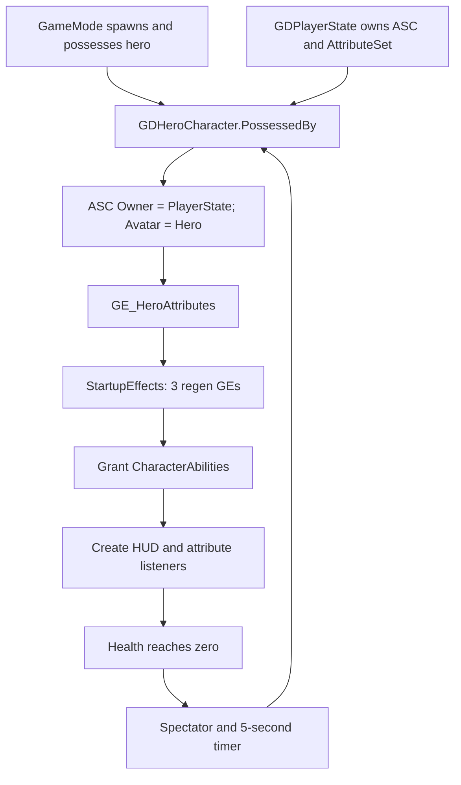

# Game Combat Engineer Test 1 — Project Context

Snapshot: **19/09/2026**. Repository: `F:\HacknSlash_Demo`. Đây là context để tiếp tục công việc, chưa phải Technical Document 1–2 trang để nộp bài.

## 1. Mục tiêu và phạm vi hiện tại

- Hack-and-slash mini project trên PC, Unreal Engine 5.4 trở lên; deadline 7 ngày từ ngày nhận đề. Chưa có ngày nhận đề chính xác để tính số ngày còn lại.
- Trọng tâm: Animation Montage, ground combo 3+ đòn, air combo 2+ đòn, bare-handed combat, transition mượt, GAS và game flow.
- Camera: smooth follow, điều chỉnh theo combat, impact shake, collision handling.
- HUD: HP, stamina, enemy health, combo counter.
- Deliverables: GitHub source, YouTube demo, Technical Document & Diagram 1–2 trang.
- Brief đầu phiên còn ghi **5+ unique attack combinations**; giữ trong checklist cho tới khi có xác nhận thay đổi yêu cầu. Không đánh đồng số animation clip với số combination đã chơi được.
- Yêu cầu lượt audit này: đọc project, tạo bộ nhớ/context, tìm nguyên nhân regen và `LMB → LMB → RMB`. Chưa yêu cầu triển khai bản sửa.

## 2. Mức độ kiểm tra

- Rà source C++/headers/build targets của module (59 file), cấu hình gameplay/input và inventory `Content/` (2.887 `.uasset`/`.umap`).
- Đọc sâu live Blueprint defaults, graph và pin connections cho hero, melee/light/heavy, combo notify, melee trace, regen GE, HUD, GameMode và PlayerController.
- Kiểm tra camera component defaults, slot/clip/blend của ground montage, topology AnimGraph `ABP_Hero` và log PIE đã có.
- Không đánh giá visual từng texture/material/VFX trong 2.887 asset. Chưa chạy build, PIE mới, packaged build hoặc đo performance trong lượt này.
- Tool không đọc được `CompositeSections`/`Notifies` của montage. Tên section, Next Section và timing notify vẫn cần kiểm tra trong Montage Editor.
- Bằng chứng cấu hình/graph lưu tại [Diagnostics/combat-audit-2026-09-19.json](Diagnostics/combat-audit-2026-09-19.json). Chi tiết lỗi và hướng chỉnh: [DEBUG_REGEN_COMBO.md](DEBUG_REGEN_COMBO.md).

## 3. Stack, repo và working state

- `HacknSlash_Demo.uproject`: `EngineAssociation = 5.8`; không dùng memory cũ để khẳng định patch version.
- Module `HacknSlash_Demo`; Game/Editor targets dùng `BuildSettingsVersion.V7`.
- Dependencies chính: GameplayAbilities, GameplayTags, GameplayTasks, EnhancedInput, Niagara, UMG.
- Project bật thêm ModelContextProtocol, Terminal, EditorToolset; máy nhận source cần có các plugin tương ứng hoặc có kế hoạch loại dependency trước khi đóng gói.
- Git branch khi audit: `main`; HEAD `a2a0db4` (`update ground combo, update src`). Không switch/stage/commit/push trong audit.
- Trước audit đã có thay đổi `.uasset`: `ANS_MeleeTrace`, `GA_MeleeAttack`, `GA_Sprint_BP`, `BP_HeroCharacter`; thư mục `Attack/AirCombo/` chưa tracked. `AGENTS.md` cũng chưa tracked.
- Live Editor báo dirty: `BP_HeroCharacter`, `GA_MeleeAttack`, `GA_MeleeHeavyAttack`. Ba regen GE không dirty. Graph đọc được có thể mới hơn file trên disk; phải kiểm tra lại trước mọi sửa đổi.

## 4. Cấu trúc và nơi bắt đầu đọc

| Khu vực | Trách nhiệm |
| --- | --- |
| `Source/HacknSlash_Demo/Public`, `Private` | GAS, character, player, AI, UI, custom ability tasks |
| `HacknSlash_DemoGameMode.cpp` | Death → spectator → respawn sau 5 giây |
| `Private/Characters/GDCharacterBase.cpp` | Init attributes, startup effects, grant/remove abilities, death |
| `Private/Characters/Heroes/GDHeroCharacter.cpp` | Possession, ASC actor info, input, camera, HUD setup |
| `Private/Player/GDPlayerState.cpp` | Sở hữu ASC/AttributeSet, attribute/tag delegates |
| `Private/Characters/Abilities/AttributeSets/GDAttributeSetBase.cpp` | Damage meta attribute, clamp HP/mana/stamina, replication |
| `Content/GASDocumentation/Characters/Hero/Abilities/Attack/` | Ground combo Blueprint/montage và air montage |
| `Content/GASDocumentation/Characters/Shared/GameplayEffects/` | Ba regen GE |
| `Content/GASDocumentation/UI/` | HUD, floating health, damage number |
| `Config/DefaultInput.ini`, `DefaultGameplayTags.ini` | Input mappings, combat tags |
| `Content/ParagonKwang`, `ParagonMinions`, các thư mục VFX | Asset pack; không mặc định coi mọi asset là gameplay đang sử dụng |

`GDGA_Attack01` hiện chỉ là subclass rỗng của `GDGA_FireGun`; combo hiện tại nằm trong Blueprint `GA_MeleeAttack`.

## 5. Game flow và GAS ownership

Map được cấu hình và đang mở: `/Game/GASDocumentation/Maps/Map_Startup`.

Live defaults của `BP_HacknSlash_DemoGameMode`:

- Default Pawn: `BP_HeroCharacter`.
- Player Controller: `BP_PlayerController`.
- Player State: `BP_PlayerState`.
- HUD class trên PlayerController: `GDHUDWidget`.

- Hero ASC dùng replication mode `Mixed`; minion tự sở hữu ASC/AttributeSet, mode `Minimal`.
- `bStartupEffectsApplied` nằm trên ASC, chỉ apply startup effects một lần. Hero ASC sống trên PlayerState qua respawn.
- Chưa thấy flow menu/playing/pause/victory/game-over hoàn chỉnh trong GameMode/PlayerController đang dùng. Respawn đang là flow của GAS sample.

## 6. Combat hiện tại

### Input và ability

- Legacy ActionMappings: `Ability1 = LMB`, `Ability2 = RMB`, `Ability3/4/5 = Q/E/R`, `Sprint = LeftShift`, `Jump = SpaceBar`.
- C++ bind ASC qua `EGDAbilityInputID`; có EnhancedInput classes/package nhưng combat path này vẫn dùng legacy GAS input binding.
- Hero được grant Jump, Sprint, Dash, PassiveArmor, Meteor, `GA_MeleeAttack`, `GA_MeleeHeavyAttack`.
- Light: AbilityInputID `Ability1`; Heavy: `Ability2`. Cả hai `InstancedPerActor`, sở hữu `State.Attacking`, bị chặn bởi Dead/Stun.
- `GE_MeleeStaminaCost`: Instant, Stamina AddBase `-10`. Light gọi CommitAbility khi bắt đầu ability; không có commit riêng ở mỗi AdvanceCombo.
- Heavy hiện là ability chuyển tiếp input: gửi `Event.Combat.HeavyInput` tới hero rồi EndAbility, không tự play montage.

### Montage và combo

- `GA_MeleeAttack` luôn play `AM_Kwang_GroundCombo`, start section `Attack_01`.
- Ground montage: slot `UpperBody`, 4 segment A/B/C/D, tổng khoảng 5,2 giây; Blend In 0,15 giây, Blend Out 0,25 giây.
- `AdvanceCombo`: index 1 → `Attack_01` tới `Attack_02`; index 2 → `Attack_02` tới `Attack_03`; index đặt tới 3 thì ngừng nhận chain tiếp.
- `AdvanceHeavyFinisher`: yêu cầu next section `Attack_02 → HeavyAttack`; reset buffer/window và đặt index 3. Chưa xác minh section `HeavyAttack` tồn tại đúng tên trong montage.
- `ANS_ComboWindow` phát Open/Close gameplay events. Payload mặc định không có Target.
- `WaitInputPress(false)` nhận LMB kế tiếp; đã xác nhận pin nối gọi lại listener sau buffer/advance. Export DSL bỏ sót shared execution tails, không dùng nó một mình để kết luận listener thiếu re-arm.
- OnCompleted/OnInterrupted/OnCancelled của task đều nối về Cleanup → EndAbility qua reroute, đã xác nhận bằng pin.
- `AM_Kwang_AirCombo` có trên disk nhưng chưa thấy ability được grant hoặc lựa chọn air montage trong melee path hiện tại. Tag `State.Airborne`/`Ability.Attack.Air` tự nó không tạo air combo.

### Hit và damage

`ANS_MeleeTrace` gọi Begin/Update/EndMeleeTrace trên hero. Begin lấy sockets `FX_weapon_base`, `FX_weapon_tip`, xóa danh sách hit trong swing. Update dùng sphere sweeps radius 10; pin graph có Contains/NOT condition để chống hit trùng trong swing.

MeleeHit payload mang target và damage → `GA_MeleeAttack` tạo GE spec → SetByCaller `Data.Damage` → `GE_MeleeDamage` sửa meta attribute Damage → AttributeSet trừ/clamp Health.

`GE_MeleeDamage.Executions` hiện rỗng, nên melee path **không qua** công thức Armor của `GDDamageExecCalculation`, dù class đó có trong C++.

## 7. Attributes, HUD và camera

- `GE_HeroAttributes`: MaxHealth/MaxMana/MaxStamina = 100; regen rates = 1/1/2; MoveSpeed = 600; Armor = 15.
- Ba regen GE: Infinite, Period = 1 giây, AttributeBased magnitude. Backing attribute reference của cả ba bị rỗng; đây là nguyên nhân regen trả về 0.
- HUD nghe Health/Mana/Stamina bằng `AsyncTaskAttributeChanged`; các attribute reference của listener còn hợp lệ. Text hiển thị regen rate không chứng minh regen đang được thực thi.
- HealthRegen chưa có tag ngăn regen khi Dead; ManaRegen ignore Dead; StaminaRegen ignore Dead và Sprinting.
- CameraBoom defaults: length 400, camera lag OFF, rotation lag OFF, collision test ON, probe 12; camera FOV 80.
- Mesh CDO tham chiếu `ABP_Hero`; AnimGraph có UpperBody và FullBody slots. `Kwang_AnimBlueprint` có trong repo nhưng không phải AnimClass trên CDO được đọc.
- Chưa xác nhận combat-aware camera, impact shake hoặc combo counter đang hoạt động trong gameplay path đã kiểm tra.

## 8. Checklist bài test

| Hạng mục | Bằng chứng hiện có / phần còn lại |
| --- | --- |
| GAS + Animation Montages | Có triển khai và wiring; chưa test regression mới |
| Ground chain 3+ | Có logic 1/2/3; cần test từng nhịp và spam |
| LMB LMB RMB | Có branch finisher; hiện bị chặn bởi event routing sai |
| Air chain 2+ | Có air montage; chưa thấy tích hợp vào ability đang grant |
| Bare-handed | Chưa thấy nhánh ability/combat tương ứng trong path hiện tại |
| 5+ combinations | Chưa có danh sách và video proof cho từng combination |
| Smooth animation | Có blend settings; chưa xác nhận visual/feel |
| Camera | Collision bật; lag tắt, combat adjustment/shake chưa chứng minh |
| HP/stamina/enemy health | Có AttributeSet/HUD/floating widget; regen đang lỗi |
| Combo counter | Chưa thấy triển khai trong HUD được đọc |
| Game flow | Có death/respawn; menu/pause/end-state chưa chứng minh |
| Deliverables | Chưa kiểm chứng link GitHub/YouTube và tài liệu nộp bài |

## 9. Quy ước khi tiếp tục

- Đọc `AGENTS.md`; private field mới `m_camelCase`, public `camelCase`; giữ reflected names hiện có để tránh hỏng Blueprint.
- Trong Unreal dùng UPROPERTY cho field editable; không áp dụng `[SerializeField]` của Unity.
- Code comment tiếng Anh; nếu gửi code thì gửi full file. Giải thích gameplay ở tầng tổ chức luật chơi, ưu tiên KISS.
- Tôn trọng các thay đổi asset đang có và Blueprint chưa save. Không Save All hoặc regenerate graph từ DSL trong một task chỉ diagnose.
- Khi user yêu cầu sửa, sửa đúng các GE/graph đã xác minh rồi test bằng PIE; không refactor hệ thống combat để chữa lỗi wiring.
- Phân biệt rõ: source review, live asset inspection, compile, runtime và visual verification.

## 10. Thứ tự tiếp tục và Definition of Done

1. Re-read ba regen GEs và graph melee trong Editor để chắc user chưa thay đổi sau snapshot.
2. Khi triển khai sửa: chọn lại backing attributes, route EventTag trước kiểm tra hit target; nối CommitAbility result.
3. Test regen: resource dưới Max, 5 periodic ticks, kiểm tra actual values và log, thêm death/respawn và sprint inhibition.
4. Test combo: một LMB; LMB LMB; LMB LMB LMB; LMB LMB RMB; input buffer sớm; input muộn; spam; thiếu stamina; interrupt.
5. Kiểm tra section links/notify timing, rồi mới tiếp tục air/bare-hand/camera/counter/game flow.
6. Cuối cùng build PC, quay demo, rút context thành Technical Document & Diagram 1–2 trang.

DoD cho hai lỗi: GE không còn CalculateMagnitude fallback, values tăng đúng 1/1/2 mỗi periodic tick khi đủ điều kiện, heavy finisher nhận được HeavyInput và play đúng section, chain cũ không regression. Hiện **chưa đạt DoD**, vì lượt này mới diagnose và lưu context.

## 11. Prompt để tiếp tục ở chat khác

> Project ở F:\HacknSlash_Demo, Unreal Engine 5.8, Game Combat Engineer Test 1. Đọc AGENTS.md, Docs/PROJECT_CONTEXT.md, Docs/DEBUG_REGEN_COMBO.md và snapshot JSON nếu cần evidence. Tôi là Unity developer chuyển sang Unreal; dùng Vietlish, KISS, giải thích gameplay flow cụ thể. Ngày 19/09/2026 đã xác nhận ba regen GE có backing Attribute rỗng/AttributeOwner None dù tên HealthRegenRate/ManaRegenRate/StaminaRegenRate còn; log CalculateMagnitude fallback to 0. Combo RMB đã kích hoạt GA_MeleeHeavyAttack và gửi Target=hero nhưng GA_MeleeAttack route IsValid(Target) trước EventTag khiến HeavyInput đi nhầm vào nhánh MeleeHit và dừng. CommitAbility.ReturnValue cũng chưa nối vào branch. Blueprint có unsaved changes, phải đọc lại live trước sửa; không đánh đồng DSL export với đầy đủ pin graph. Chưa sửa gameplay/chưa chạy PIE mới. Tiếp tục theo yêu cầu mới của tôi, giữ nguyên thay đổi đang có, xác minh regen/combo xong mới mở rộng air/bare-hand/camera/HUD/game flow.

## Rủi ro và giới hạn

- Snapshot có thể stale sau khi user sửa/save asset; luôn đối chiếu live Editor và Git.
- Thay backing attribute có thể làm regen có hiệu lực cả trong lúc chết nếu tag guard chưa đúng.
- StartupEffects chỉ apply một lần trên ASC: cần PIE mới hoặc reapply effect khi kiểm tra thay đổi GE; chỉ nhìn effect đang tồn tại dễ cho kết quả cũ.
- Thông số CDO không thay thế việc kiểm tra override trên actor instance hoặc visual runtime.
