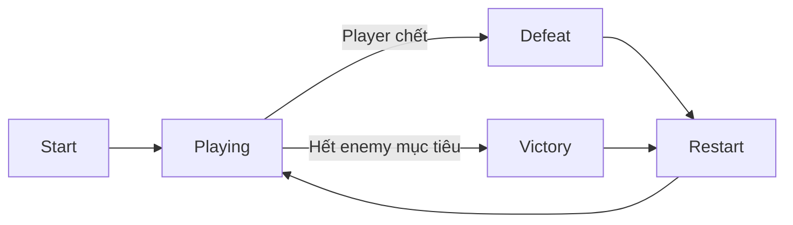

# HacknSlash_Demo — Project review và hướng dẫn cải thiện

Ngày audit: 22/09/2026. Project: `F:\HacknSlash_Demo`, Unreal Engine 5.8.

## 1. Kết luận

Ưu tiên hoàn thiện một vòng chơi có combat, feedback, HUD và kết thúc rõ ràng. Nền GAS/combo đã có nhiều phần dùng được; chưa cần viết lại kiến trúc hoặc mở thêm nhánh Poison.

Thứ tự đề xuất: **chốt SwordSlash ngắn → sửa health regen khi chết → regression combat và payload impact → HUD/combo counter → camera → Victory/Defeat/Restart → polish và packaged build**.

Các đề xuất bên dưới chưa được triển khai. Đây là báo cáo audit và hướng dẫn; không phải bằng chứng game đã pass.

## 2. Phạm vi và mức độ bằng chứng

Đã kiểm tra:

- Toàn bộ 1.379 dòng `Docs/HACKNSLASH_MASTER_CONTEXT.md`, các tài liệu combat và kết quả fixture cũ liên quan.
- 59/59 file trong `Source/`, 7/7 file trong `Config/` và `HacknSlash_Demo.uproject`.
- Inventory 2.991 file asset/map trên disk. Không đọc sâu từng texture, material hoặc asset mẫu không nằm trong gameplay hiện tại.
- Live graph/defaults: Hero, ground/heavy, air/launcher, bare-hand, trace/notifies, damage/regen GEs, GameplayCues, HUD/enemy HP, GameMode, PlayerController, minion spawners và Level Blueprint.
- Pin thật của trace và các ability chính; không kết luận dây bị thiếu chỉ từ DSL export.
- AnimGraph topology, montage clip/slot/blend, camera defaults và Editor viewport.
- Lượt PIE khởi tạo lúc 09:33:55 UTC có log lỗi class widget của Hero/Minion. Không có fresh input regression, HP-delta test hay visual acceptance đầy đủ trong lượt audit này.

Giới hạn:

- Chưa build C++/package mới, chưa đo performance, chưa test multiplayer.
- 8/8 ground, 10/10 air-hold, 4 bare-hand trong tài liệu là kết quả lịch sử.
- Runtime section links và vị trí notify chưa được đọc đầy đủ qua API; không suy ra chúng chỉ từ danh sách animation segments.
- Bước kiểm tra dirty cuối từng bị chặn bởi hạn mức automatic approval review. Sau resume đã đọc lại được HealthRegen; lần đọc lại graph spawner không hoàn tất. Spawner findings dưới đây dùng snapshot live đã đọc trước đó.
- Không thực hiện lệnh sửa source/config, graph hoặc defaults; không Save All, không stage/commit/switch branch. Có khởi tạo PIE; Editor tự compile một số Blueprint trước play. Worktree có thay đổi sẵn và tiếp tục biến động trong phiên; BP_MinionSpawner xuất hiện thêm trong Git status cuối nên không khẳng định mọi asset trên disk giữ nguyên byte, cũng không tự revert thay đổi đó.

## 3. Những phần đã có — giữ lại

| Hệ thống | Bằng chứng hiện tại |
| --- | --- |
| Ground input | LMB ngoài window đăng ký lại listener; không dùng input sớm. RMB cần index 2 và window mở. |
| Ground cleanup | Commit thất bại và montage Completed/Interrupted/Cancelled nối về cleanup/end. |
| One hit per swing | Cả hai trace có `NOT Contains(HitActorsThisSwing, HitActor)` trước AddUnique và gửi event. |
| Hit payload | Trace tạo TargetData từ sweep HitResult; ground ability copy sang outgoing EffectContext. |
| Air lifecycle | Có Air_01/Air_02, giữ/thả gravity, State.AirComboUsed, reset khi landing, timeout 3 giây và cleanup. |
| Bare-hand | Đã grant ability, có F switch state/ẩn weapon, LMB chain và heavy input forwarder. |
| HUD | HP/Stamina và enemy HP có widget/delegate path; không cần dựng lại từ đầu. |
| Regen backing attributes | Health/Mana/Stamina đã trỏ đúng rate attributes; lỗi reference rỗng trong context 19/09 đã cũ. |
| Camera collision | SpringArm đã bật collision test, ProbeSize 12, channel Camera. |
| Poison | Giữ contract 5s/1s/+10, stack limit 3, refresh/reset. Vẫn là P2. |

`GetAbilitySystemComponent` để trống Actor trong nhánh switch không phải lỗi: UE 5.8 có metadata `DefaultToSelf="Actor"`.

## 4. Các việc cần sửa, theo tác động

### A. Chặn HealthRegen khi chết — ưu tiên sửa trước

**Finding:** `GE_HealthRegen` đang Infinite, period 1 giây; Ongoing Tag Requirements không ignore `State.Dead`. Đã đọc lại sau resume, vẫn trống.

C++ nhận thay đổi Health rồi clamp; `IsAlive()` chỉ kiểm tra Health > 0. Vì vậy một tick regen có thể đưa nhân vật đang death montage trở lại trạng thái “alive” về mặt logic, trong khi collision/gravity và Dead tag vẫn ở trạng thái chết.

Bằng chứng:

- `Source/HacknSlash_Demo/Private/Characters/GDCharacterBase.cpp:37`: IsAlive.
- `Source/HacknSlash_Demo/Private/Characters/GDCharacterBase.cpp:241`: Die.
- `Source/HacknSlash_Demo/Private/Characters/Abilities/AttributeSets/GDAttributeSetBase.cpp:204`: xử lý Health.
- `Source/HacknSlash_Demo/Private/Characters/GDCharacterMovementComponent.cpp:24`: movement dựa trên IsAlive.

**Checkpoint sửa thủ công:**

1. Mở `/Game/GASDocumentation/Characters/Shared/GameplayEffects/GE_HealthRegen`.
2. Class Defaults → Components → component **Target Tag Requirements**.
3. Mở **Ongoing Tag Requirements → Ignore Tags**, thêm `State.Dead`.
4. Giữ nguyên modifier, rate và period. Không đặt riêng điều kiện này vào Application Tag Requirements: effect đã được apply từ lúc spawn.
5. Compile và save đúng asset này.
6. PIE: gây chết player và một minion, quan sát HP phải giữ 0 trong death montage/respawn delay. Sau respawn, giảm HP một lần và kiểm tra regen hoạt động lại.

**Done:** không tăng HP trong death state; respawn vẫn hồi được. Đây là test cần chạy, chưa phải kết quả đã pass.

### B. Impact VFX chưa nhận HitResult ở ba nhánh attack

**Finding đã xác nhận bằng pin:** `Break Gameplay Event Data.TargetData` chưa được nối ở `GA_AirAttack`, `GA_Launcher`, `GA_BareHandAttack`. Cả ba vẫn dùng `GE_MeleeDamage`; `GC_MeleeImpact` chỉ spawn khi EffectContext có HitResult.

Damage có thể vẫn chạy, nhưng cue này không nhận vị trí impact từ sweep của ba nhánh đó. Ground attack đã có đoạn xử lý đúng để làm mẫu.

**Hướng sửa từng ability:**

1. Tìm nhánh `Event.Combat.MeleeHit`.
2. Giữ nguyên dây Target, ASC và EventMagnitude → `Data.Damage`.
3. Sau `Assign Tag Set By Caller Magnitude`, kiểm tra `Target Data Has Hit Result` với index 0.
4. True: lấy EffectContext từ **chính SpecHandle đã assign damage**, lấy HitResult từ TargetData, gọi `Add Hit Result` với Reset = true.
5. True sau AddHitResult và False của check đều đi tới node Apply GE hiện có.
6. Test hit/miss của riêng ability vừa sửa rồi mới làm ability tiếp theo.

Giữ SwordSlash ở montage notify để vẫn hiện khi miss. Không đưa Poison hoặc DamageExecution vào thay đổi này.

### C. HUD còn thiếu Combo Counter

`GDHUDWidget` hiện có HP/Stamina, Mana, XP/Gold và UI skill của sample; chưa có combo counter trong luồng được audit.

Thiết kế nhỏ đề xuất:

- `m_comboCount` nằm trên Hero hoặc PlayerController; không lấy `CurrentComboIndex` của một ability làm HUD counter.
- Mỗi hit trực tiếp được chấp nhận lên target còn sống tăng 1; hai target nhận hit là hai hit.
- Refresh timer **2 giây** sau mỗi hit; hết timer hoặc player chết thì reset.
- Dùng chung một function cập nhật counter cho ground/air/launcher/bare-hand.
- Widget nhận event cập nhật; không cần Tick binding.
- Không đếm từ mọi lần HealthChanged: regen và Poison không phải hit combo.

**Done:** miss không tăng; Poison không tự tăng; đổi ground sang air vẫn giữ chuỗi nếu còn timer; hết 2 giây/chết/restart thì reset đúng.

HP/Stamina đã có pipeline; ưu tiên làm gọn layout, giảm thông tin XP/Gold/Mana/skill không cần cho phần trình diễn melee.

### D. Camera cần thêm follow lag, combat framing và shake

Live defaults: **Arm 400, FOV 80, Camera Lag OFF, Rotation Lag OFF, collision ON**. Chưa có combat framing/shake trong gameplay path đã đọc. Project có `BP_CS_01` trong pack Easy Impact Frames, nhưng asset tồn tại không chứng minh đã được dùng.

Baseline để bắt đầu tune:

| Tham số | Giá trị đề xuất |
| --- | --- |
| Enable Camera Lag | ON |
| Camera Lag Speed | 10 |
| Normal Arm / FOV | Giữ 400 / 80 |
| Combat Arm / FOV | 450 / 85 |
| Thời gian chuyển framing | 0,2 giây |
| Thời gian chờ trả normal | 1 giây sau khi hết attack |

Đây là giá trị thử, chưa phải contract đã chốt.

Điều khiển framing từ trạng thái attack, dùng Timeline và một timer trả camera. Khi attack mới bắt đầu, hủy timer trả normal để camera không co/giãn liên tục giữa hai lần đánh.

Camera Shake phát từ hit được chấp nhận; light nhỏ, heavy/launcher mạnh hơn. Một swing trúng nhiều target cần giới hạn shake để tránh rung cộng dồn.

**Done:** follow khi chạy/dash không gây khó điều khiển, combat nhìn đủ player và target, lùi sát tường không xuyên, hit có phản hồi rõ.

### E. Game flow hiện vẫn là sandbox respawn

- `HacknSlash_DemoGameMode.cpp:24`: chết → spectator → timer respawn 5 giây.
- BP GameMode EventGraph và Level Blueprint không có flow thắng/thua.
- Snapshot `BP_MinionSpawner`: minion chết thì đặt timer spawn lại; hai spawner trên map có RespawnDelay = 2 giây.
- Minion đang dùng CharacterAbilities rỗng và EventGraph rỗng; chưa thấy combat AI trong hai Blueprint minion này.

Đề xuất mini-game nhỏ:

- GameMode giữ `Playing / Victory / Defeat` và tập enemy mục tiêu của trận.
- Đăng ký enemy lúc spawn; `OnCharacterDied` chỉ trừ mỗi enemy một lần.
- Chỉ xét Victory sau khi hoàn tất spawn và danh sách enemy sống rỗng.
- Khi đã Victory/Defeat, khóa attack/input liên quan và hiện result widget.
- Restart phải reset world/enemies/HP/combo/camera; với demo một map, reload map là cách đơn giản.
- Tắt nhánh minion respawn vô hạn trong mode chơi hữu hạn.
- **Cần sửa nhánh auto-respawn trong C++ GameMode**: `HeroDied` hiện là hàm native thường, không phải Blueprint override event. Chỉ thêm Defeat widget sẽ vẫn bị respawn sau 5 giây.
- `OnCharacterDied` được broadcast trước khi C++ add Dead tag; listener nên tin death event, không yêu cầu Dead tag đã có ngay lúc callback.

Sau P0, thêm một loại enemy biết tiếp cận và đánh có telegraph để trận đấu có thử thách. Không cần Behavior Tree lớn cho checkpoint đầu. Đây là cải thiện trải nghiệm được đề xuất, không tự nâng thành requirement gốc.

### F. Sửa native widget reference và guard nhỏ trước build

Hai đường dẫn C++ sai đã tái hiện Error trong lượt PIE mới:

| File | Asset class đúng |
| --- | --- |
| `Private/Characters/Heroes/GDHeroCharacter.cpp:48` | `/Game/GASDocumentation/UI/GDFloatingStatusBar_Hero.GDFloatingStatusBar_Hero_C` |
| `Private/Characters/Minions/GDMinionCharacter.cpp:40` | `/Game/GASDocumentation/UI/GDFloatingStatusBar_Minion.GDFloatingStatusBar_Minion_C` |

Blueprint override hiện đúng, nên không kết luận HUD đang hỏng hoàn toàn. Sửa native fallback để hết startup error và không phụ thuộc vào override để cứu reference.

Ngoài ra, `GDAttributeSetBase.cpp:123` dereference TargetCharacter sau optional cast; `:198` dùng Source không guard khi cấp bounty. Cần guard trước khi mở rộng sang target có ASC nhưng không kế thừa GDCharacterBase hoặc damage không có Source ASC. Chưa tái hiện crash của các nhánh này.

Manual respawn cũng có unchecked Controller/Pawn/PlayerStart/Spawn result/EnemySpawnPoint; giải quyết cùng checkpoint game flow, tránh sửa hai lần một luồng sắp thay đổi.

## 5. Các thay đổi polish đáng làm

### Presentation

Viewport vẫn ghi **Left Mouse: Fire Gun / Right Mouse: Aim Down Sights / E: Passive armor**, không khớp controls melee hiện tại.

Thay bằng hướng dẫn:

- WASD: di chuyển; Mouse: camera.
- LMB: attack, nối đòn trong combo window.
- RMB: heavy branch trong window đòn 2.
- E: launcher; F: Sword/Bare-hand.
- Q: dash; Shift: sprint; Space: jump.

Hai `MultiSphereTraceForObjects` trong `BP_HeroCharacter.UpdateMeleeTrace` đang **Draw Debug Type = ForDuration, Draw Time = 5 giây**. Khi quay demo, đặt None. Tắt Print to Screen của các debug combat; giữ log phục vụ test khi cần.

Dọn UI/text sample và các test volumes khỏi map trình diễn; giữ một map test riêng để kiểm tra regen, damage và regression.

### Stamina

Hiện MaxStamina = 100, regen = 2/s, GE_MeleeStaminaCost = -10. Mỗi activation của các attack chính Commit một lần; các section nối không Commit lại.

0 → 100 cần khoảng **50 giây không tiêu thêm stamina**. Với demo ngắn, đây là điểm nên test feel.

Sau khi regression pass, baseline đề xuất là **10/s**, đồng thời thêm `State.Attacking` vào Ongoing Ignore của StaminaRegen để tránh hồi toàn bộ cost ngay khi combo đang chạy. Giữ cost -10 cho checkpoint đầu; chưa cần hệ cost riêng cho từng section. Đây là đề xuất balance mới, chưa áp dụng.

### Animation và feedback

- Ground dùng các clip Slow với play rate 1; air lặp cùng `PrimaryAttack_Air` hai lần.
- Bare-hand có FullBody slot; sword/air/launcher dùng UpperBody.
- AnimGraph vẫn có rifle aim offsets của sample.

Những điểm này không tự chứng minh animation sai. Khi test bằng mắt, ưu tiên chân trượt, vai/vũ khí bị xoắn theo camera, khoảng dừng giữa sections và độ rõ của Air1/Air2. Chỉ chỉnh phần gây lỗi quan sát được; giữ window input cũ cho đến khi đã có baseline.

Chốt SwordSlash bằng một hit và một miss. Nếu Niagara component đã bám socket nhưng particles còn ở world space, kiểm tra Local Space theo từng emitter. Không đổi toàn bộ VFX trước khi biết emitter nào gây vấn đề.

## 6. Regression và submission

| Checkpoint | Test cần đạt |
| --- | --- |
| Ground | LMB 1/2/3 hit; LMB-LMB-RMB; bấm sớm bị bỏ; cùng window chỉ chọn một lệnh |
| Damage | Mỗi target nhận một direct hit mỗi swing; không dùng Poison ticks để kết luận duplicate melee |
| Air | E → LMB → LMB có hit thực, gravity trả đúng khi end/cancel/timeout/landing |
| Bare-hand | F vật lý đổi mode; weapon ẩn/hiện; light chain có damage; heavy chạy đúng section |
| Health/death | Regen bình thường khi sống, HP giữ 0 khi chết |
| HUD | HP/Stamina/enemy HP cập nhật, combo counter không đếm Poison |
| Camera | Follow, combat framing, shake, wall collision |
| Flow | Victory và Defeat riêng; restart hai lần liên tiếp sạch |
| Build | Windows package chạy ngoài Editor, thiếu plugin/reference không làm fail |

Lưu ý fixture BareHand cũ kiểm tra checkpoint RMB chỉ in log và dừng ở Attack_02. Graph live hiện đã gọi `AdvanceHeavyCombo → HeavyAttack`; cần cập nhật expected result theo design hiện tại trước khi dùng fixture cũ làm acceptance.

Sửa diagram technical document thành **Player Input → ASC → Ability** cho đúng hiện trạng: project dùng EnhancedInput classes nhưng combat vẫn bind legacy action/axis + GAS enum. Không cần migration input chỉ để tên diagram đẹp hơn.

Đổi ProjectName đang là template; rà dev plugins khi packaging. Chưa có bằng chứng packaged build chạy được hoặc performance đạt mục tiêu; nên smoke build sớm trong giai đoạn hoàn thiện P0.

## 7. Prompt để tiếp tục ở chat khác

> Project F:\HacknSlash_Demo, UE 5.8. Đọc AGENTS.md, Docs/HACKNSLASH_MASTER_CONTEXT.md và Docs/PROJECT_REVIEW_2026-09-22.md. Đây là audit, chưa triển khai thay đổi gameplay. Giữ no-early-input-buffer, Poison 5s/1s/+10/stack3/refresh-reset, bỏ damage numbers. Bước sửa nhỏ đầu tiên: GE_HealthRegen > Target Tag Requirements component > Ongoing Tag Requirements > Ignore Tags thêm State.Dead, rồi PIE xác nhận HP giữ 0 khi chết và regen lại sau respawn. Sau đó xử lý TargetData/HitResult còn chưa nối trong GA_AirAttack, GA_Launcher, GA_BareHandAttack theo mẫu ground; HUD combo counter, camera, game flow. Đọc lại asset live trước sửa vì user có thể đã chỉnh tiếp. Không coi fixture cũ, graph wiring hoặc PIE khởi tạo là full gameplay proof. Đi từng checkpoint, giữ các thay đổi khác trong worktree.

## 8. Rủi ro và side-effect

- Regen inhibition phải dùng Ongoing requirements để tác động cả effect đã tồn tại; không đánh dấu Done trước death/respawn test.
- Copy HitResult sẽ làm impact cue xuất hiện ở các attack trước đó thiếu payload; cần kiểm tra vị trí và mật độ VFX.
- Tăng stamina regen làm tài nguyên dễ quản lý hơn; cần test với chặn hồi khi Attacking/Sprinting.
- Camera lag quá chậm và shake cộng dồn làm giảm khả năng quan sát combat.
- Đổi montage rate/notify timing sẽ thay đổi độ dài combo window và có thể làm fixture cũ mất phù hợp.
- Flow hữu hạn phải ngắt auto-respawn; nếu không, result UI và world state sẽ mâu thuẫn.
- Chỉ chỉnh đúng asset/file của checkpoint. Không revert hoặc Save All các thay đổi người dùng đang làm.
