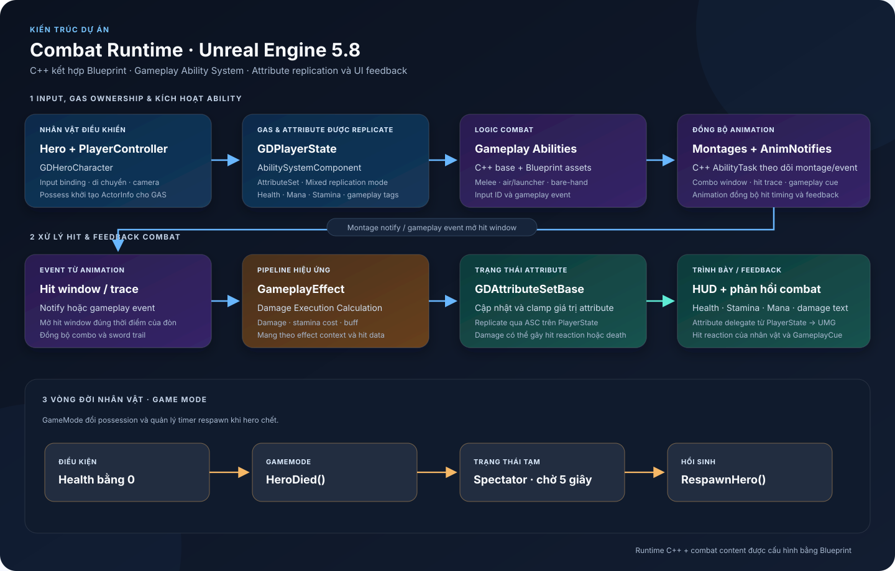

# Hack & Slash Demo

## Technical Overview

**Thể loại:** third-person action combat prototype  
**Engine:** Unreal Engine 5.8  
**Core stack:** C++, Blueprint, Gameplay Ability System (GAS), UMG  
**Source:** [GitHub repository](https://github.com/zimbear3103/HacknSlash_Demo)

### Tổng quan

Demo tập trung vào combat nhân vật bằng Unreal GAS. C++ cung cấp runtime foundation dùng chung như Ability System Component (ASC), attribute và damage handling, input binding, HUD updates và respawn flow. Blueprint chứa các ability và animation assets theo từng kiểu combat, giúp tinh chỉnh gameplay và presentation ngay trong Editor.

Project có asset cho ground melee/combo, air launcher, bare-hand attack và sword-trail feedback. Luồng combat kết hợp Gameplay Tags, Gameplay Effects, animation montage và event/notify để đồng bộ hành động, hit window và phản hồi UI.

### Architecture

### Luồng gameplay

1. `GDHeroCharacter` nhận input và liên kết avatar với ASC được giữ trên `GDPlayerState`.
2. ASC kích hoạt ability theo input ID hoặc gameplay event. C++ ability task phát montage và lắng nghe montage/event callbacks; Blueprint cung cấp cấu hình ability, montage và notify theo combat move.
3. Gameplay Effect chuyển damage/cost vào GAS. Damage execution xử lý damage; `GDAttributeSetBase` cập nhật và clamp các chỉ số như Health, Mana, Stamina.
4. `GDPlayerState` lắng nghe attribute delegates và chuyển thay đổi tới HUD/status widgets. Attribute được replicate cùng ASC.
5. Khi hero chết, `HacknSlash_DemoGameMode` chuyển controller sang spectator và respawn hero sau timer 5 giây.

### Phân chia trách nhiệm

- **C++:** `GDPlayerState`, `GDHeroCharacter`, `GDCharacterBase`, Ability System/AttributeSet, montage-event ability task, damage execution, HUD binding và `GameMode` lifecycle.
- **Blueprint & animation assets:** ground/air/bare-hand abilities, gameplay effects/cues, montage, animation notify và hiệu ứng trail.
- **UI feedback:** `GDHUDWidget` nhận health/stamina/mana; damage text và hit reactions được nối qua player/character systems.

### Nền tảng và kiểm chứng

Project target Unreal Engine 5.8; module khai báo GameplayAbilities, GameplayTags, GameplayTasks, UMG, EnhancedInput và Niagara. Các `.uasset`/`.umap` được quản lý bằng Git LFS.

Local Editor PIE đã khởi chạy trên `Map_Startup`. Tài liệu này xác nhận cấu trúc từ source/assets; chưa dùng để khẳng định toàn bộ feature đã qua visual pass hoặc packaged build.

